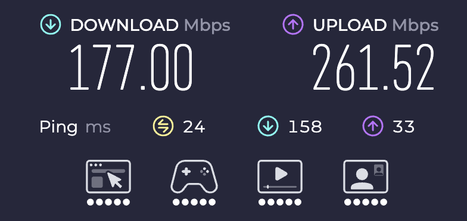
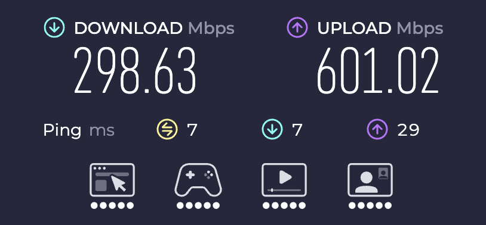

# mac-wifi-latency-tuner

macOS scripts for diagnosing and reducing Wi-Fi latency spikes. Built with Claude Code.

## Try it yourself — no setup needed

Paste this as a goal in [Claude Code](https://claude.ai/code) or [Codex](https://chatgpt.com/codex), sit back, and let it run:

```
Diagnose and fix my Wi-Fi latency spikes on macOS. Run network diagnostics to measure router latency, internet latency, DNS speed, Wi-Fi signal, and loaded responsiveness. Identify the root cause — channel width, interference, bufferbloat, DNS, or app load. Apply any safe Mac-side fixes automatically. Give me a clear, specific action plan for any router changes needed, with target numbers to verify it worked.
```

Claude/Codex will run the full diagnostic, explain what it finds, and tell you exactly what to change.

## Results

| Before | After |
|---|---|
|  |  |

**Before:** 177 Mbps down, ping spiking to 158 ms
**After:** 298 Mbps down, ping dropped to 7 ms

## Problem

Fast download/upload speeds but high latency spikes — router pings spiking to 70–100 ms, Apple Network Quality loaded responsiveness above 150 ms.

## Root cause

5 GHz channel at 160 MHz channel width causes airtime contention and bufferbloat. Dropping to 80 MHz and choosing a less-congested channel fixes it.

## Scripts

| Script | What it does |
|---|---|
| `network-retune-check.sh` | Full diagnostic: Wi-Fi signal, router latency, internet latency, DNS, Apple Network Quality. Logs to CSV. |
| `network-usage-now.sh` | Shows which apps are using the network and current Wi-Fi health. |
| `after-router-change.sh` | Waits 60s then runs the full check — use this right after changing router settings. |
| `compare-network-results.sh` | Summarizes all logged runs and shows before/after delta. |

## Usage

```bash
# Run a full diagnostic and log it
./network-retune-check.sh

# Check which apps are hogging bandwidth
./network-usage-now.sh

# After changing router settings
./after-router-change.sh

# Compare all logged runs
./compare-network-results.sh
```

## Recommended router settings (5 GHz)

- Channel width: **80 MHz** (not 160 MHz)
- Channel: **149, 153, 157, or 161** (or 36/40/44/48 if those aren't available)
- Enable QoS/SQM if available — set download to ~85% of your plan speed

## What "good" looks like

- Router max ping: < 30 ms
- Internet max ping: < 40 ms
- Apple loaded responsiveness: < 100 ms

## Requirements

- macOS (tested on macOS 15+)
- `networkQuality` — built into macOS 12+
- `dig` — install via `brew install bind` if missing
